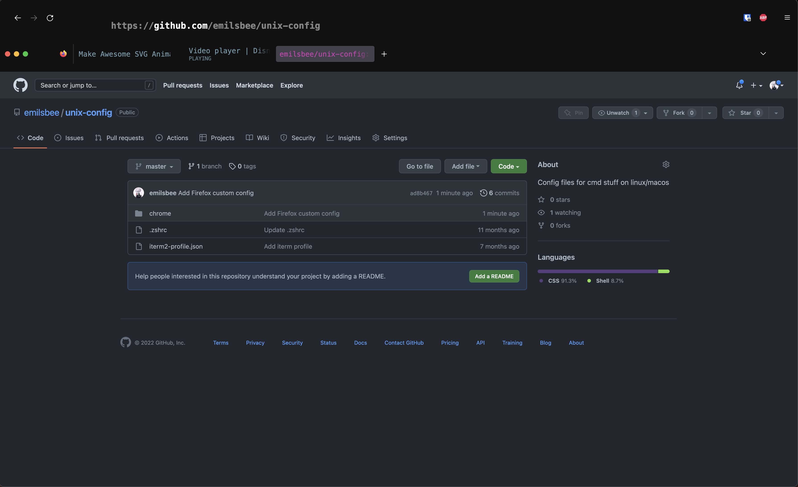

# Firefox custom theme
The setup was copied from this repository https://github.com/SirCharlieMars/dotfiles. In order to set it up check out the guide here https://www.userchrome.org/how-create-userchrome-css.html. The theme should look like this at the end:

